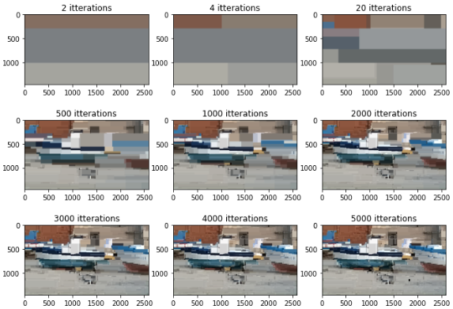

# Regression Tree

This was a final project for my Math of Data Mining and Pattern Recognition course. It basically recovers the information from a MysterImage which has had >99% of its pixels removed at random (i'm guessing a uniform distribution). Luckily, the pixels are distributed randomly throughout the image so we can extrapolate much of the remaining information. We do this by using a regression tree, which much like a decision tree, tries to box the pixels together so that the color differences are minimized, which we quantify with the MSE (mean squared error). Read about the details in "Math_444___Final.pdf"

